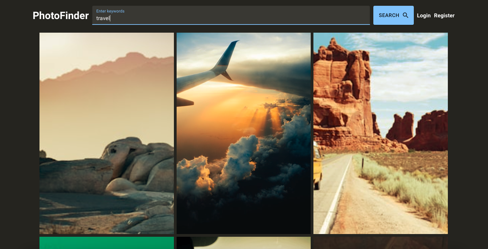

# Photo finder application (React/TS/Redux/RTKQuery/Firebase/MaterialUI/Vite)

The Photo Finder helps to explore a variaty of pictures by searching request.

[Check the App](https://photo-finder-react-redux-ts.vercel.app/)



## Features

- Registration/Authorization
- Search photo by any word
- Adding Favourite photo for authorized users
- Search History for authorized users

## Stack


## How to run locally

- install dependencies

```sh
npm install
```

- start local server via Vite

```sh
npm run dev
```
